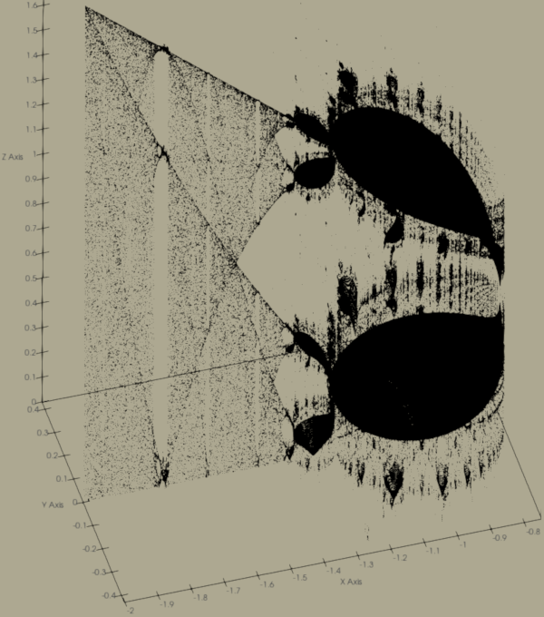

## logistic-map

This repository contains code to generate and visualize the [logistic
map](https://en.wikipedia.org/wiki/Logistic_map) using Python 3. It
depends on matplotlib, sympy, and tqdm.

## The Logistic Map

The logistic map is based on an iterated expression for population
growth (and decay), where *x* is between 1 (saturation) and 0 (death):

    *x ← rx(1 - x)*

The map, or bifurcation diagram, results from plotting the last *n*
iterations of the expression for each growth rate *r*, with 0 < *r* < 4.

This function has a peak at (½, ¼). You can test any function you like
by changing `f` in [logistic.py](logistic.py). SymPy is called upon to
find local extrema, compute the value of the local maximum on the
interval `[0, 1]`, and scale the function so that its maximum is ¼. If
the extrema cannot be calculated (e.g., transcendental functions), the
peak is assumed to lie at *x*=½, and the function is scaled to the value
there. SymPy also converts the expression to LaTeX for use as the graph
title. `python logistic.py` takes a minute or three to run on my
machine, and creates `logistic.png`.

## The Mandelbrot Set

The [Mandelbrot set](https://en.wikipedia.org/wiki/Mandelbrot_set) is
the result of iterating the *complex* expression

    *z ← z² + c*

The point at complex coordinate *c* is part of the set if the iterations
do not diverge. Often, the set is plotted with contours indicating how
many iterations it takes to exceed some threshold value, indicating
divergence, with the yet-to-diverge points plotted in black.

An alternative visualization, implemented by @johnnyhyman
[here](https://github.com/jonnyhyman/Chaos) for a Veritasium
[video](https://youtu.be/ovJcsL7vyrk), plots the last *n* values of the
iterated expression, for test point *c* within the real interval [-2, 1]
and complex interval [-1, 1]. Viewed "top-down," this results in a
pixelated Mandelbrot set. Viewed from other angles, one can see the
intersection between the logistic map and the Mandelbrot set along the
real axis, with beautiful structure revealed elsewhere. To reduce
runtime, the main bulb ("period-1 continent") of the Mandelbrot is
excluded; this code focuses on the smaller, period-2 continent and the
needle.

On my machine, `python mandelbrot.py` runs for up to 3 hours. When it
finishes, it will write `mandelbrot.pts` containing the 3-D points
within the set [Re(*c*), Im(*c*), Re(*z*)]. 

Feel free to try other iterated expressions!
