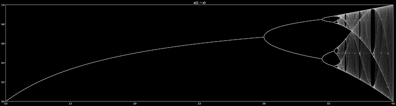

# Logistic Maps



This repository contains code to generate and visualize the [logistic
map](https://en.wikipedia.org/wiki/Logistic_map) using Python. It
depends on matplotlib and sympy. To use this software, simply edit the
"`f`" expression at the top of [logistic.py](logistic.py). The standard
equation is

``` python
x * (1 - x)
```

This function has a peak at (½, ¼); any test function should maintain
this value at its peak, whether that occurs at *x*=½ or not. SymPy is
therefore called upon to find local extrema, compute the value of the
local maximum on the interval `[0, 1]`, and scales the function
accordingly. If the extrema cannot be calculated (e.g., transcendental
functions), the peak is assumed to lie at *x*=½, and the function is
scaled to the value there. SymPy also converts the expression to LaTeX
for use as the graph title.
